<section class="info-section">

  

    <h3>REQUIRED</h3>
    
[3] Honey to start with + [HM Fly], [HM Cut], [HM Rock Smash] and [HM Surf]

  

  

    <h3>RECOMMENDED</h3>
    
Honey Gather Pokémon: Combee or Teddiursa [HA], [HM Defog], [Repel]

  

</section>
<section class="honey-intro">
  <h1>INTRODUCTION</h1>

  

    <!-- Left Column -->
    

      <h2>Honey Tree Shiny Hunting Guide</h2>
      

        This guide will teach you how to efficiently shiny hunt Honey Trees, which are exclusive to the <strong>Sinnoh</strong> region.
      

      

        The route begins in <strong>Canalave City</strong> and ends near <strong>Sunyshore City</strong>.
      

      

        There are <strong>21 Honey Trees</strong> in total; however, we recommend skipping the one on <strong>Route 221</strong> (near Pal Park), as it’s typically not worth the travel time.
      

      <h3>Two Main Methods</h3>
      <ol>
        <li><strong>Run + Slather</strong> – quickly reapplying honey and moving on.</li>
        <li><strong>Battle the Pokémon</strong> – lead with a Pokémon that knows <strong>Honey Gather</strong>, or a combo of <strong>Frisk + Thief</strong>.</li>
      </ol>

      <h3>Team Shiny Legion [MANY]</h3>
      

        By using this guide, you’re assumed to be a member of <strong>Team Shiny Legion [MANY]</strong>.
      

      

        Need help? Message <strong>Kelly</strong> or <strong>Kole</strong> in-game, in the club, or on Discord.
      

      
<em>Not a member yet?</em> Mail or whisper Kelly to join or learn more.

    

    <!-- Middle Column -->
    

      <h3>Timing</h3>
      <ul>
        <li>Trees take 1 hour to attract Pokémon after applying honey.</li>
      </ul>

      <h3>Held Items by Pokémon</h3>
      <ul>
        <li>Munchlax<ul><li>Leftovers</li></ul></li>
        <li>Combee<ul><li>Honey</li></ul></li>
        <li>Cherubi<ul><li>Miracle Seed</li></ul></li>
        <li>Wurmple<ul>
          <li>Pecha Berry</li>
          <li>Bright Powder</li>
        </ul></li>
      </ul>
    

    <!-- Right Column -->
    

      <h3>Available Pokémon</h3>
      <ul>
        <li>Common
          <ul>
            <li>Combee</li>
            <li>Wurmple</li>
          </ul>
        </li>
        <li>Uncommon
          <ul>
            <li>Aipom</li>
            <li>Burmy</li>
            <li>Cherubi</li>
          </ul>
        </li>
        <li>Rare
          <ul>
            <li>Cascoon</li>
            <li>Silcoon</li>
          </ul>
        </li>
        <li>Very Rare
          <ul>
            <li>Heracross</li>
            <li>Munchlax</li>
          </ul>
        </li>
      </ul>
    

  

</section>

<section class="honey-tree-section">
  

    

      <h3>🍯 Honey Tree 1</h3>
      
<em>Canalave City → Route 218</em>

      <ul>
        <li>Fly to <strong>Canalave City</strong></li>
        <li>Go South, then East into <strong>Route 218 Gate</strong></li>
        <li>Find the Honey Tree near the water</li>
      </ul>
    

    

      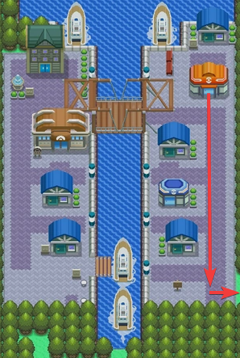
    

    

      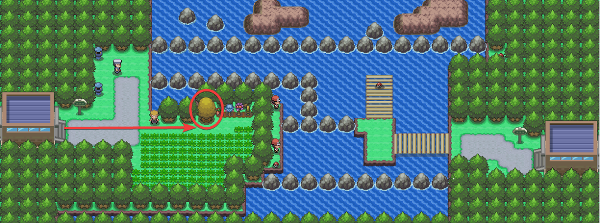
    

  

</section>

<section class="honey-tree-section">
  

    

      <h3>🍯 Honey Tree 2</h3>
      
<em>Floaroma Town → Floaroma Meadow</em>

      <ul>
        <li>Fly to Floaroma Town</li>
        <li>Go West, then North into Floaroma Meadow</li>
        <li>Talk to NPC, you need a total of [60] Honey</li>
        <li>Find the Honey Tree east of the NPC</li></li>
      </ul>
    

    

      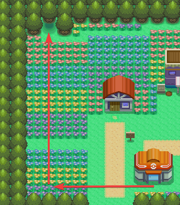
    

    

      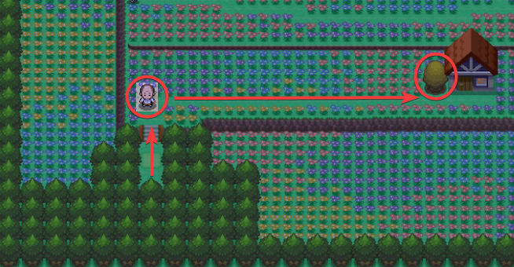
    

  

</section>

<section class="honey-tree-section">
  

    

      <h3>🍯 Honey Tree 3</h3>
      
<em>Floaroma Town → Route 205 → Valley Windworks</em>

      <ul>
        <li>Fly back to Floaroma Town</li>
        <li>Go East into Route 205</li>
        <li>Continue East into Valley Windworks</li>
        <li>Find the Honey Tree on the East side of Valley Windworks</li>
      </ul>
    

    

      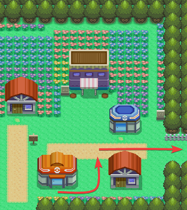
    

    

      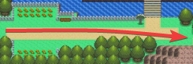
    

    

      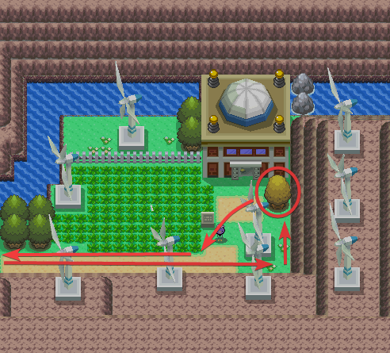
    

  

</section>

<section class="honey-tree-section">
  

    

      <h3>🍯 Honey Tree 4</h3>
      
<em>Valley Windworks → Route 205</em>

      <ul>
        <li>Go back West into Route 205</li>
        <li>Go North, across the bridge</li>
        <li>Find the Honey Tree on the other side of the bridge</li>
      </ul>
    

    

      
    

    

      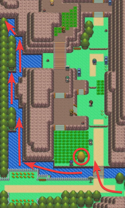
    

  

</section>

<section class="honey-tree-section">
  

    

      <h3>🍯 Honey Tree 5</h3>
      
<em>Route 205 → Fuego Ironworks</em>

      <ul>
        <li>Use HM Surf on the water below the Honey Tree</li>
        <li>Surf West and then North, following the path of the water</li>
        <li>Continue until you reach land in Fuego Ironworks</li>
        <li>Find the Honey Tree North of the water</li>
      </ul>
    

    

      
    

    

      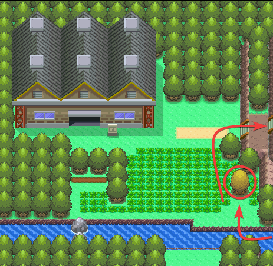
    

  

</section>

<section class="honey-tree-section">
  

    

      <h3>🍯 Honey Tree 6</h3>
      
<em>Fuego Ironworks → Route 205 → Eterna Forest</em>

      <ul>
        <li>Go North through the grass</li>
        <li>Go East, up the stairs and into Route 205</li>
        <li>Go South and jump down twice</li>
        <li>Go East and then North past the house and into the outside part of Eterna Forest (East of Eterna Forest entrance)</li>
        <li>Use HM Cut and continue North</li>
        <li>Find the Honey Tree North of the trees you used Cut on</li>
      </ul>
    

    

      
    

    

      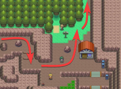
    

    

      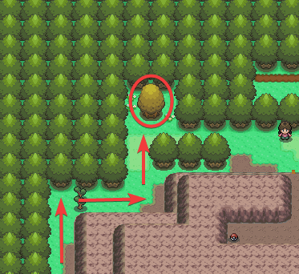
    

  

</section>

<section class="honey-tree-section">
  

    

      <h3>🍯 Honey Tree 7</h3>
      
<em>Eterna City → Route 205</em>

      <ul>
        <li>Fly to Eterna City</li>
        <li>Go West into Route 205</li>
        <li>Find the Honey Tree North of the first patch of grass</li>
      </ul>
    

    

      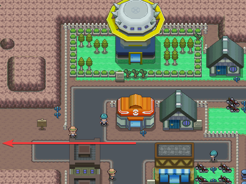
    

    

      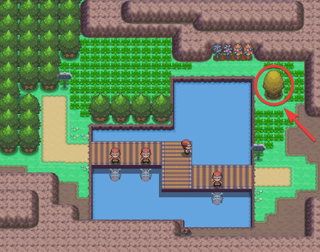
    

  

</section>

<section class="honey-tree-section">
  

    

      <h3>🍯 Honey Tree 8</h3>
      
<em>Oreburgh City → Route 207</em>

      <ul>
        <li>Fly to Oreburgh City</li>
        <li>Go North into Route 207</li>
        <li>Go East of the grass and down the stairs</li>
        <li>Ride your bike North, up the mudslide</li>
        <li>Find the Honey Tree North of the mudslide</li>
      </ul>
    

    

      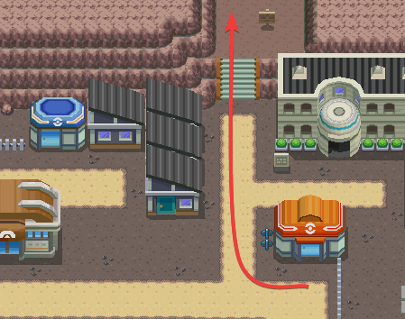
    

    

      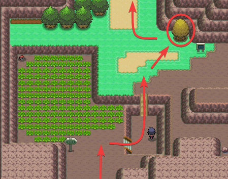
    

  

</section>

<section class="honey-tree-section">
  

    

      <h3>🍯 Honey Tree 9</h3>
      
<em>Route 207 → Route 206</em>

      <ul>
        <li>Go North from the last Honey Tree, into route 206</li>
        <li>Go down one set of stairs</li>
        <li>Go East and then North</li>
        <li>Use HM Cut on the trees and continue North</li>
        <li>Find the Honey Tree on the other side of the bridge</li>
      </ul>
    

    

      
    

    

      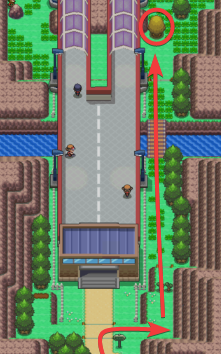
    

  

</section>

<section class="honey-tree-section">
  

    

      <h3>🍯 Honey Tree 10</h3>
      
<em>Hearthome City → Route 208</em>

      <ul>
        <li>Fly to Hearthome City</li>
        <li>Go South until you reach the white fence</li>
        <li>Go East until you reach the first path that goes South</li>
        <li>Go South and then West into Route 208</li>
        <li>Find the Honey Tree below the grass</li>
      </ul>
    

    

      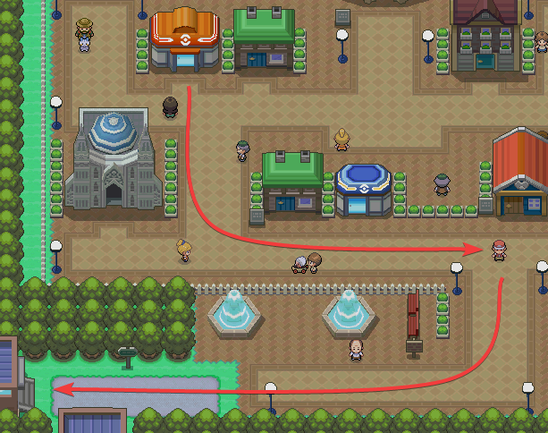
    

    

      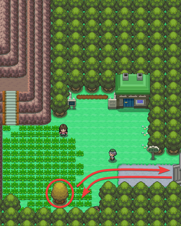
    

  

</section>

<section class="honey-tree-section">
  

    

      <h3>🍯 Honey Tree 11</h3>
      
<em>Route 208 → Hearthome City → Route 212</em>

      <ul>
        <li>Go back East into Hearthome City</li>
        <li>Go South into Route 212</li>
        <li>Go South until you reach the first single tree</li>
        <li>Go East into the little opening in the trees</li>
        <li>Find the Honey Tree in the open area</li>
      </ul>
    

    

      
    

    

      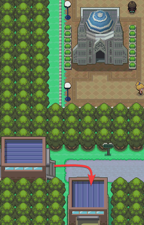
    

    

      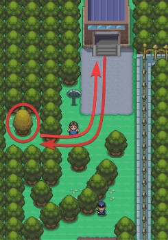
    

  

</section>

<section class="honey-tree-section">
  

    

      <h3>🍯 Honey Tree 12</h3>
      
<em>Route 212 → Hearthome City → Route 209</em>

      <ul>
        <li>Go back North into Hearthome City</li>
        <li>Go East into Route 209</li>
        <li>Continue East, going across two bridges</li>
        <li>Find the Honey Tree North of the last bridge</li>
      </ul>
    

    

      
    

    

      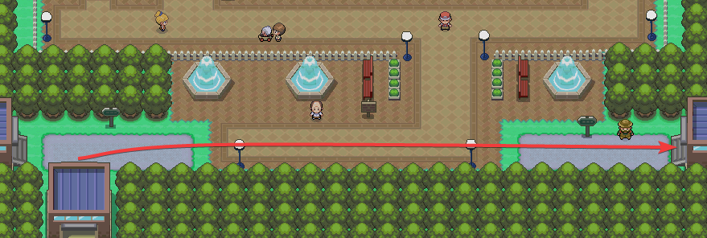
    

    

      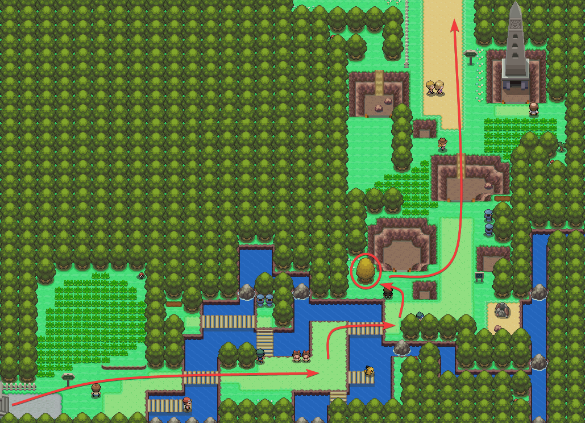
    

  

</section>

<section class="honey-tree-section">
  

    

      <h3>🍯 Honey Tree 13</h3>
      
<em>Route 209 → Solaceon Town → Route 210</em>

      <ul>
        <li>Go East of the tree back to the path</li>
        <li>Go North, down the stairs, up the mudslide and into Solaceon Town</li>
        <li>Go North through Solaceon Town into Route 210</li>
        <li>Continue North, up the mudslide and down the stairs to the end of the tall grass</li>
        <li>Find the Honey Tree East of the tall grass</li>
      </ul>
    

    

      
    

    

      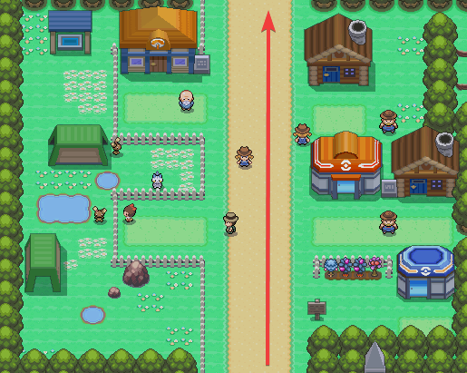
    

    

      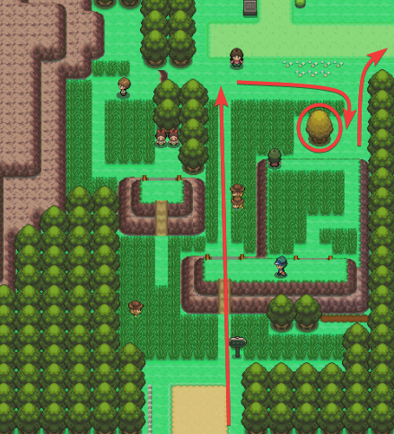
    

  

</section>

<section class="honey-tree-section">
  

    

      <h3>🍯 Honey Tree 14</h3>
      
<em>Route 210 → Route 215</em>

      <ul>
        <li>Go North to the path</li>
        <li>Go East into Route 215</li>
        <li>Continue East, up the stairs</li>
        <li>Go North, across the bridge</li>
        <li>Go West, down the stairs</li>
        <li>Find the Honey Tree North of the stairs</li>
      </ul>
    

    

      
    

    

      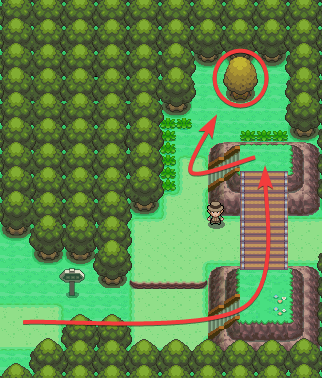
    

  

</section>

<section class="honey-tree-section">
  

    

      <h3>🍯 Honey Tree 15</h3>
      
<em>Celestic Town → Route 211</em>

      <ul>
        <li>Fly to Celestic Town
            &nbsp;&nbsp;&nbsp;&nbsp;If you are battling, this is where I heal PP of moves
        </li>
        <li>Go West past the NPC house</li>
        <li>Go North to the path</li>
        <li>Go West into Route 211</li>
        <li>Find the Honey Tree in the grass</li>
      </ul>
    

    

      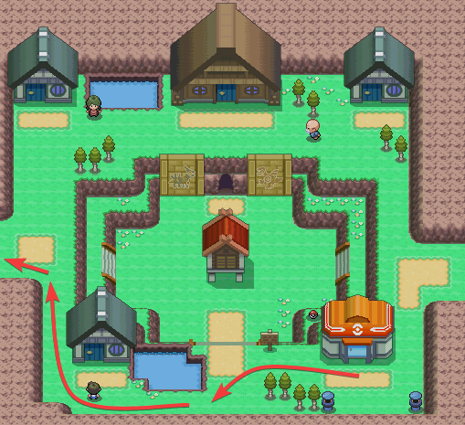
    

    

      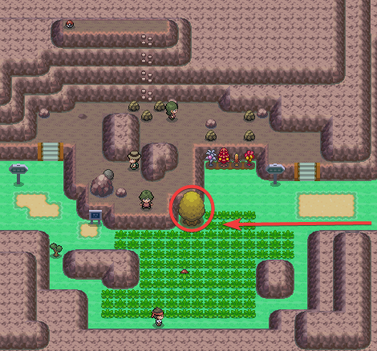
    

  

</section>

<section class="honey-tree-section">
  

    

      <h3>🍯 Honey Tree 16</h3>
      
<em>Celestic Town → Route 210</em>

      <ul>
        <li>Fly back to Celestic Town</li>
        <li>Go North to the path</li>
        <li>Go East into Route 210
            &nbsp;&nbsp;&nbsp;&nbsp;If you are battling, this is where I use HM Defog
        </li>
        <li>Continue East, down the stairs and across the bridge</li>
        <li>Go South, up the stairs</li>
        <li>Go North, across the bridge</li>
        <li>Go East, across the bridge</li>
        <li>Go South, down two sets of stairs</li>
        <li>Go East, through the grass</li>
        <li>Find the Honey Tree above the last patch of grass</li>
      </ul>
    

    

      
    

    

      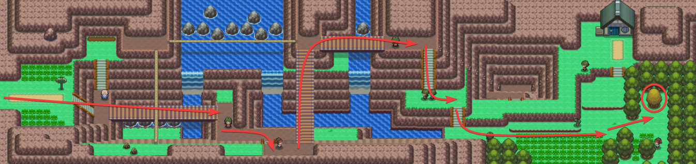
    

  

</section>

<section class="honey-tree-section">
  

    

      <h3>🍯 Honey Tree 17</h3>
      
<em>Pastoria City → Route 212</em>

      <ul>
        <li>Fly to Pastoris City</li>
        <li>Go South, past the Pokè-Mart</li>
        <li>Go West, following the path into Route 212</li>
        <li>Take the South path on Route 212</li>
        <li>Continue West, through the grass and into the swamp</li>
        <li>Find the Honey Tree North of the swamp water</li>
      </ul>
    

    

      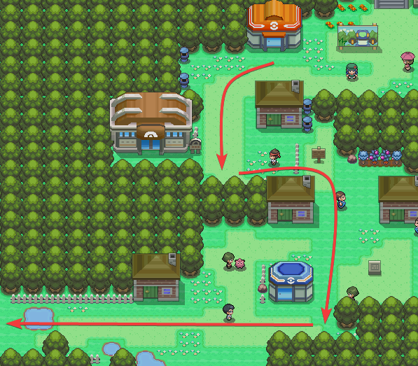
    

    

      
    

  

</section>

<section class="honey-tree-section">
  

    

      <h3>🍯 Honey Tree 18</h3>
      
<em>Pastoria City → Route 213</em>

      <ul>
        <li>Fly back to Pastoria City</li>
        <li>Go East into Route 213</li>
        <li>Continue East, through the grass</li>
        <li>Go South into the sand</li>
        <li>Go West, behind the house and use HM Rock Smash</li>
        <li>Find the Honey Tree on the West side of the rock</li>
      </ul>
    

    

      
    

    

      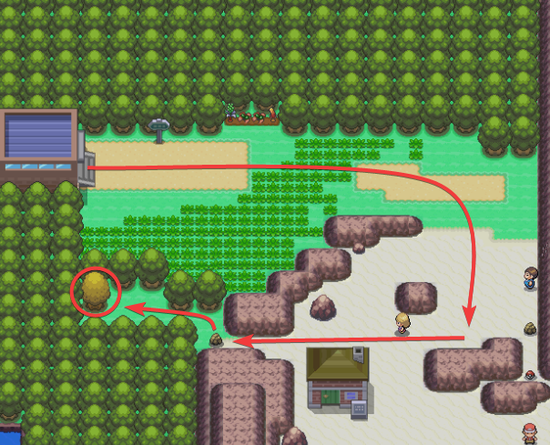
    

  

</section>

<section class="honey-tree-section">
  

    

      <h3>🍯 Honey Tree 19</h3>
      
<em>Veilstone City → Route 214</em>

      <ul>
        <li>Fly to Veilstone City</li>
        <li>Go South into Route 214</li>
        <li>Continue South until you get to the fence maze</li>
        <li>Go South through the fence maze</li>
        <li>Find the Honey Tree on the other side of the white fence after the fence maze</li>
      </ul>
    

    

      
    

    

      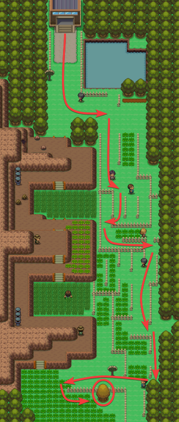
    

  

</section>

<section class="honey-tree-section">
  

    

      <h3>🍯 Honey Tree 20</h3>
      
<em>Sunyshore City → Route 222</em>

      <ul>
        <li>Fly to Sunyshore City</li>
        <li>Go West into Route 222</li>
        <li>Find the Honey Tree North of the gate exit</li>
        <li>This is the last Honey Tree of the route!
            &nbsp;&nbsp;&nbsp;&nbsp;Now you must wait 1 hour irl time before you start again
        </li>
      </ul>
    

    

      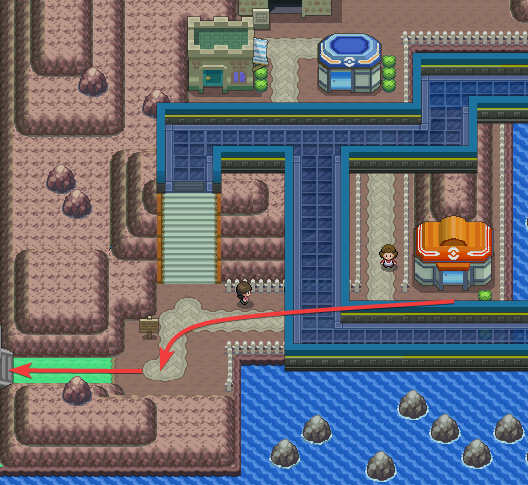
    

    

      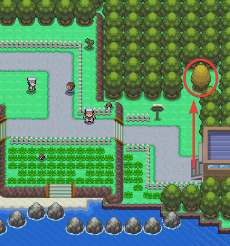
    

  

</section>

