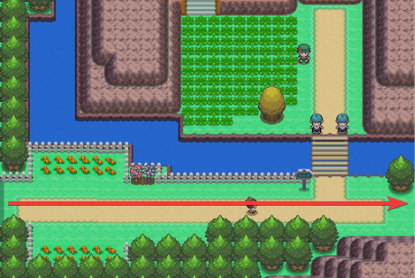

<section class="info-section">

  

    <h3>REQUIRED</h3>
    
[3] Honey to start with + [HM Fly], [HM Cut], [HM Rock Smash] and [HM Surf]

  

  

    <h3>RECOMMENDED</h3>
    
Honey Gather Pokémon: Combee or Teddiursa [HA], [HM Defog], [Repel]

  

</section>
<section class="honey-intro">
  <h1>INTRODUCTION</h1>

  

    <!-- Left Column -->
    

      <h2>Honey Tree Shiny Hunting Guide</h2>
      

        This guide will teach you how to efficiently shiny hunt Honey Trees, which are exclusive to the <strong>Sinnoh</strong> region.
      

      

        The route begins in <strong>Canalave City</strong> and ends near <strong>Sunyshore City</strong>.
      

      

        There are <strong>21 Honey Trees</strong> in total; however, we recommend skipping the one on <strong>Route 221</strong> (near Pal Park), as it’s typically not worth the travel time.
      

      <h3>Two Main Methods</h3>
      <ol>
        <li><strong>Run + Slather</strong> – quickly reapplying honey and moving on.</li>
        <li><strong>Battle the Pokémon</strong> – lead with a Pokémon that knows <strong>Honey Gather</strong>, or a combo of <strong>Frisk + Thief</strong>.</li>
      </ol>

      <h3>Team Shiny Legion [MANY]</h3>
      

        By using this guide, you’re assumed to be a member of <strong>Team Shiny Legion [MANY]</strong>.
      

      

        Need help? Message <strong>Kelly</strong> or <strong>Kole</strong> in-game, in the club, or on Discord.
      

      
<em>Not a member yet?</em> Mail or whisper Kelly to join or learn more.

    

    <!-- Middle Column -->
    

      <h3>Timing</h3>
      <ul>
        <li>Trees take 1 hour to attract Pokémon after applying honey.</li>
      </ul>

      <h3>Held Items by Pokémon</h3>
      <ul>
        <li>Munchlax<ul><li>Leftovers</li></ul></li>
        <li>Combee<ul><li>Honey</li></ul></li>
        <li>Cherubi<ul><li>Miracle Seed</li></ul></li>
        <li>Wurmple<ul>
          <li>Pecha Berry</li>
          <li>Bright Powder</li>
        </ul></li>
      </ul>
    

    <!-- Right Column -->
    

      <h3>Available Pokémon</h3>
      <ul>
        <li>Common
          <ul>
            <li>Combee</li>
            <li>Wurmple</li>
          </ul>
        </li>
        <li>Uncommon
          <ul>
            <li>Aipom</li>
            <li>Burmy</li>
            <li>Cherubi</li>
          </ul>
        </li>
        <li>Rare
          <ul>
            <li>Cascoon</li>
            <li>Silcoon</li>
          </ul>
        </li>
        <li>Very Rare
          <ul>
            <li>Heracross</li>
            <li>Munchlax</li>
          </ul>
        </li>
      </ul>
    

  

</section>

<section class="honey-tree-section">
  

    

      <h3>🍯 Honey Tree 1</h3>
      
<em>Canalave City → Route 218</em>

      <ul>
        <li>Fly to <strong>Canalave City</strong></li>
        <li>Go South, then East into <strong>Route 218 Gate</strong></li>
        <li>Find the Honey Tree near the water</li>
      </ul>
    

    

      
    

    

      
    

  

</section>

<section class="honey-tree-section">
  

    

      <h3>🍯 Honey Tree 2</h3>
      
<em>Floaroma Town → Floaroma Meadow</em>

      <ul>
        <li>Fly to Floaroma Town</li>
        <li>Go West, then North into Floaroma Meadow</li>
        <li>Talk to NPC, buy [60] Honey</li>
        <li>Find the Honey Tree east of the NPC</li></li>
      </ul>
    

    

      
    

    

      
    

  

</section>

<section class="honey-tree-section">
  

    

      <h3>🍯 Honey Tree 3</h3>
      
<em>Canalave City → Route 218</em>

      <ul>
        <li>Fly back to Floaroma Town</li>
        <li>Go East into Route 205</li>
        <li>Continue East into Valley Windworks</li>
        <li>Find the Honey Tree on the East side of Valley Windworks</li>
      </ul>
    

    

      
    

    

      
    

  

</section>

<section class="honey-tree-section">
  

    

      <h3>🍯 Honey Tree 4</h3>
      
<em>Canalave City → Route 218</em>

      <ul>
        <li>Fly to <strong>Canalave City</strong></li>
        <li>Go South, then East into <strong>Route 218 Gate</strong></li>
        <li>Find the Honey Tree near the water</li>
      </ul>
    

    

      
    

    

      
    

  

</section>

<section class="honey-tree-section">
  

    

      <h3>🍯 Honey Tree 5</h3>
      
<em>Canalave City → Route 218</em>

      <ul>
        <li>Fly to <strong>Canalave City</strong></li>
        <li>Go South, then East into <strong>Route 218 Gate</strong></li>
        <li>Find the Honey Tree near the water</li>
      </ul>
    

    

      
    

    

      
    

  

</section>

